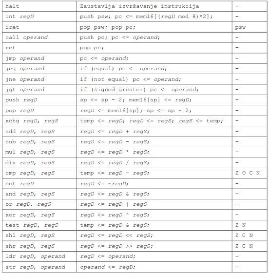

# Asenzt - Two-pass Assembler

Simple two-pass assembler for the pre-defined assembly language - Project for System Software Course (School of Electrical Engineering 2021)

## Make

Compiling the assembler:
```sh
make
```

## Run

For defualt run `assembler -o izlaz.o ulaz.s`: 
```sh
make run
```

For arbitrary run:
```sh
assembler -o output_object_file.o input_file.s
```

Run tests:
```sh
make test
```

## Input sample

```
# file: interrupts.s 
.section ivt 
   .word isr_reset 
   .skip 2 # isr_error 
   .word isr_timer 
   .word isr_terminal 
   .skip 8 
.extern myStart, myCounter 
.section isr 
.equ term_out, 0xFF00 
.equ term_in, 0xFF02 
.equ asciiCode, 84 # ascii(’T’) 
# interrupt routine for reset 
isr_reset: 
   jmp myStart 
# interrupt routine for timer
isr_timer: 
   push r0 
   ldr r0, $asciiCode 
   str r0, term_out 
   pop r0 
   iret 
# interrupt routine for terminal
isr_terminal: 
   push r0 
   push r1 
   ldr r0, term_in 
   str r0, term_out 
   ldr r0, %myCounter # pcrel 
   ldr r1, $1 
   add r0, r1 
   str r0, myCounter # abs 
   pop r1 
   pop r0 
   iret 
.end 

# file: main.s 
.global myStart 
.global myCounter 
.section myCode 
.equ tim_cfg, 0xFF10 
myStart: 
   ldr r0, $0x1 
   str r0, tim_cfg 
wait: 
   ldr r0, myCounter 
   ldr r1, $5 
   cmp r0, r1 
   jne wait 
   halt 
.section myData 
myCounter: 
   .word 0 
.end 
```

## Assembler directives

List of assembler directives:
* .global list_of_symbols
* .extern list_of_symbols
* .section section_name
* .word list_of_symbols_or_literals
* .skip literal
* .equ new_symbol, literal
* .end

## Assembler instructions


